---
## Front matter
title: "Отчёта по лабораторной работе №2"
subtitle: "Простейший вариант"
author: "Чигладзе Майя Владиславовна"

## Generic otions
lang: ru-RU
toc-title: "Содержание"

## Bibliography
bibliography: bib/cite.bib
csl: pandoc/csl/gost-r-7-0-5-2008-numeric.csl

## Pdf output format
toc: true # Table of contents
toc-depth: 2
lof: true # List of figures
lot: true # List of tables
fontsize: 12pt
linestretch: 1.5
papersize: a4
documentclass: scrreprt
## I18n polyglossia
polyglossia-lang:
  name: russian
  options:
	- spelling=modern
	- babelshorthands=true
polyglossia-otherlangs:
  name: english
## I18n babel
babel-lang: russian
babel-otherlangs: english
## Fonts
mainfont: PT Serif
romanfont: PT Serif
sansfont: PT Sans
monofont: PT Mono
mainfontoptions: Ligatures=TeX
romanfontoptions: Ligatures=TeX
sansfontoptions: Ligatures=TeX,Scale=MatchLowercase
monofontoptions: Scale=MatchLowercase,Scale=0.9
## Biblatex
biblatex: true
biblio-style: "gost-numeric"
biblatexoptions:
  - parentracker=true
  - backend=biber
  - hyperref=auto
  - language=auto
  - autolang=other*
  - citestyle=gost-numeric
## Pandoc-crossref LaTeX customization
figureTitle: "Рис."
tableTitle: "Таблица"
listingTitle: "Листинг"
lofTitle: "Список иллюстраций"
lotTitle: "Список таблиц"
lolTitle: "Листинги"
## Misc options
indent: true
header-includes:
  - \usepackage{indentfirst}
  - \usepackage{float} # keep figures where there are in the text
  - \floatplacement{figure}{H} # keep figures where there are in the text
---

# Цель работы

Целью работы является изучить идеологию и применение средств контроля версий. Приобрести практические навыки по работе с системой git.

# **Выполнение лабораторной работы **

## Базовая настройка git.
Сначала сделаем предварительную конфигурацию git, указав имя и email владельца репозитория (Рис.1).
Настроим utf-8 в выводе сообщений git, используя дополнение к команде «core.qoutepath false» (Рис.1).
Зададим имя начальной ветки (будем называть её master) (Рис.1).
Также настроим параметры autocrlf и safecrlf (Рис.1).

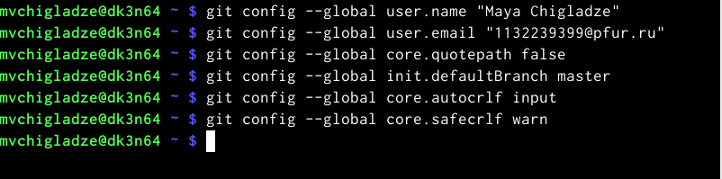{#fig:001 width=70%}

## Создание SSH ключа.
Для последующей идентификации пользователя на сервере репозиториев генерируем пару ключей (приватный и открытый) (Рис. 2). Ключи будут храниться в каталоге ~/.ssh/.

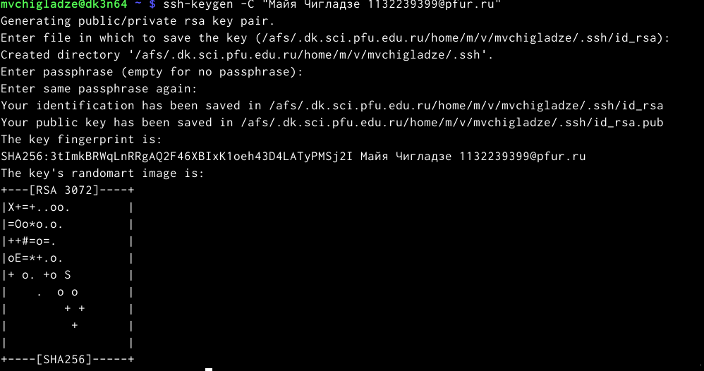{#fig:001 width=70%}

Скопируем из локальной консоли ключ в буфер обмена (Рис. 3)

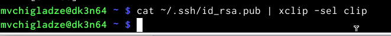{#fig:001 width=70%}

Далее необходимо загрузить сгенерённый открытый ключ на сайте http: //github.org/ под своей учётной записью. Вставили ключ в появившееся на сайте поле и указали для ключа имя (Title) (Рис. 4).

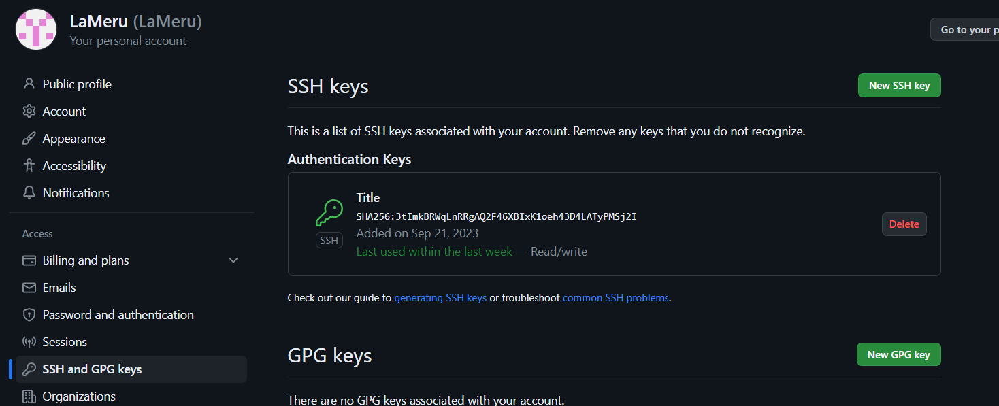{#fig:001 width=70%}

## Создание рабочего пространства и репозитория курса на основе шаблона
При выполнении лабораторных работ следует придерживаться структуры рабочего пространства. Рабочее пространство по предмету располагается в  иерархии. Каталоги для лабораторных работ имеют вид lab<номер>, например: lab01, lab02 и т.д. (Рис. 5)

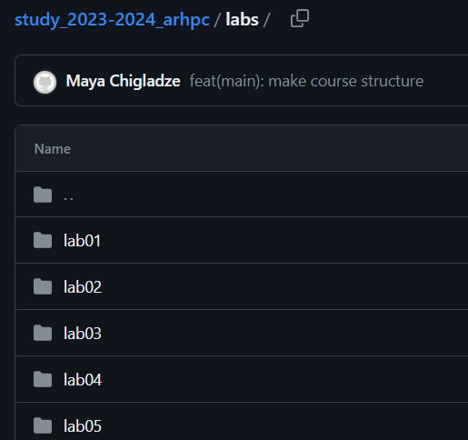{#fig:001 width=70%}

Открываем терминал и создаем каталог для предмета «Архитектура компьютера» (Рис. 6)

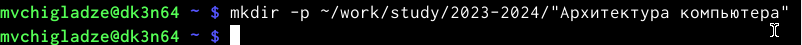{#fig:001 width=70%}

## Создание репозитория курса на основе шаблона
Перейдем в каталог курса (Рис. 7) и клонируем созданный репозиторий (Рис. 8)

{#fig:001 width=70%}

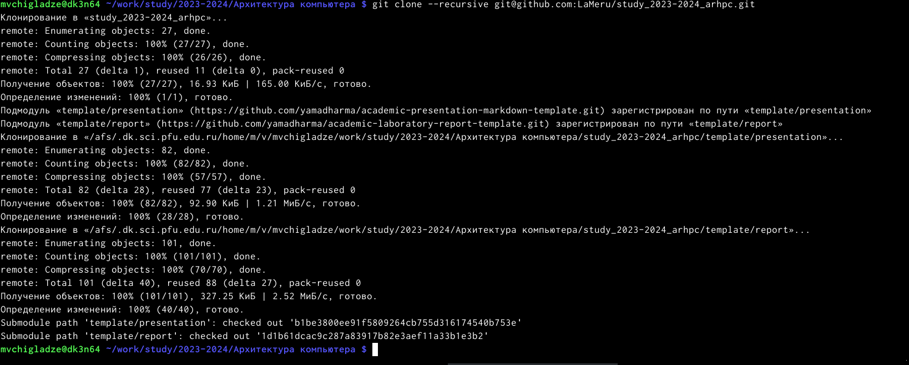{#fig:001 width=70%}

## Настройка каталога курса
Перейдем в каталог курса (Рис. 9).

{#fig:001 width=70%}

Удалим лишние файлы и создадим необходимые каталоги (Рис. 10)

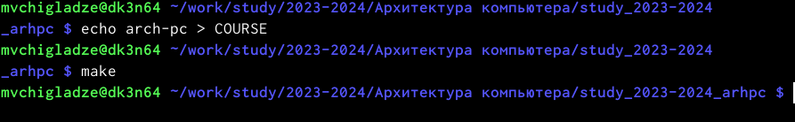{#fig:001 width=70%}

Отправим файлы на сервер (Рис. 11 и Рис. 12)

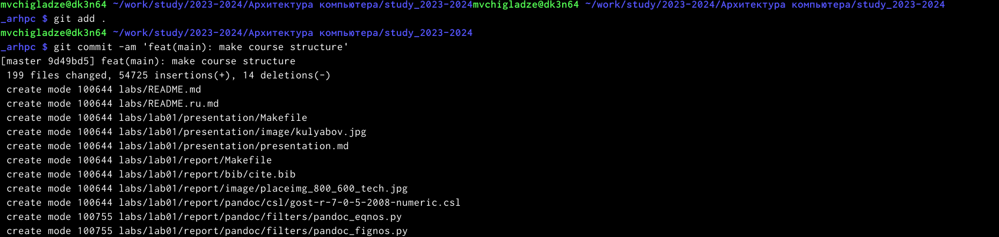{#fig:001 width=70%}

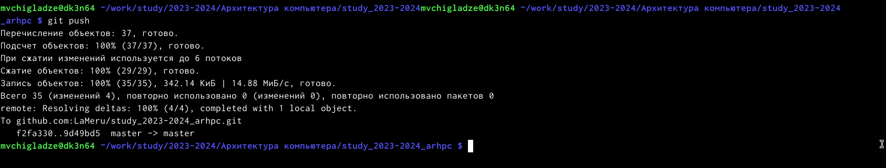{#fig:001 width=70%}

Проверяем правильность создания иерархии рабочего пространства на странице github (Рис. 13)

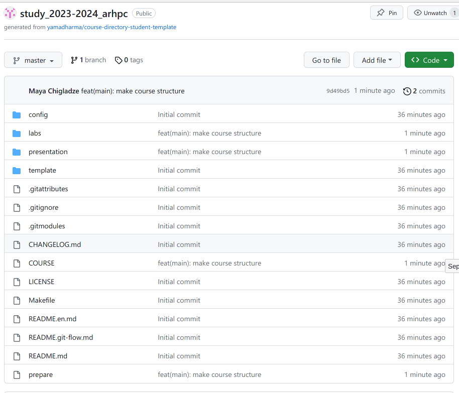{#fig:001 width=70%}

# **Задание для самостоятельной работы.**

 Все проделанные операции с отчетом по Лабораторной работе №1 будут аналогичны сделаны и для текущей Лабораторной работы №2, подверждение этого отражено в моем репозитори на github по ссылке: https://github.com/LaMeru/study_2023-2024_arhpc
1/2. Создайте отчет по выполнению лабораторной работы в соответствующем каталоге рабочего пространства (labs>lab02>report)/ Скопируйте отчеты по выполнению предыдущих лабораторных работ в соответствующие каталоги созданного рабочего пространства.
Путь к нужной директории начался с Домашней папки (Рис. 14) и закончился папкой report, куда и был перемещен отчет по Лабораторной работе №1 в формате pdf (Рис. 15).

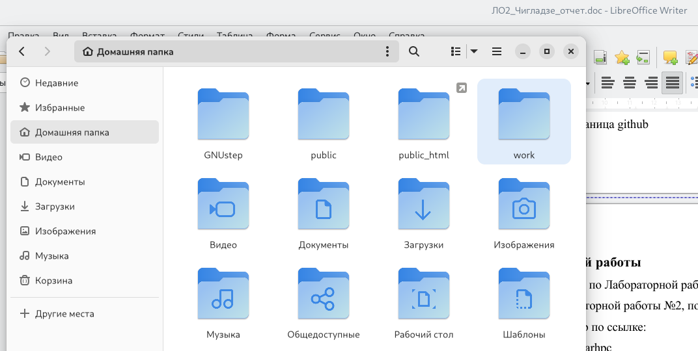{#fig:001 width=70%}

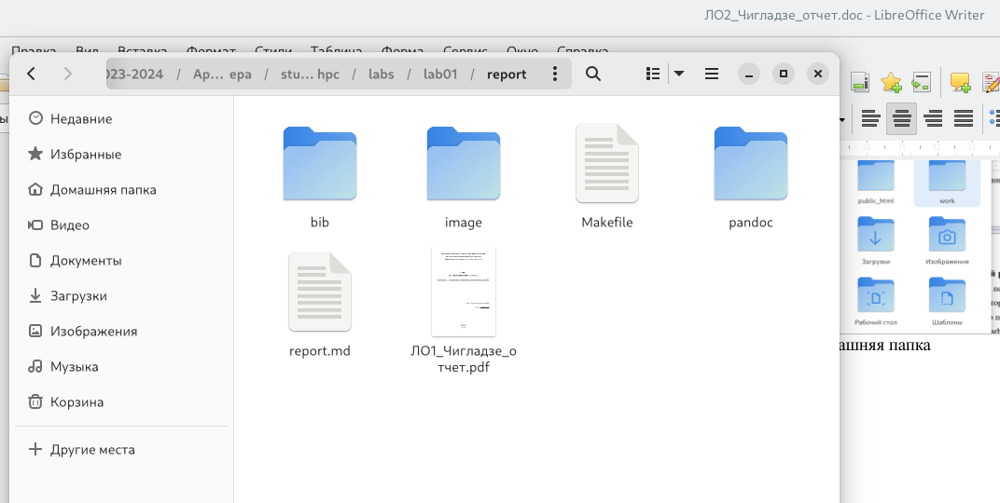{#fig:001 width=70%}

 3. Загрузите файлы на github.
Проверим наличие установленного github и ssh ключа на устройстве (Рис.16)

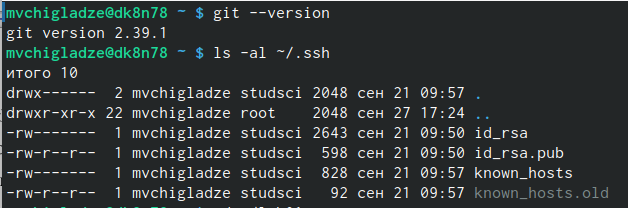{#fig:001 width=70%}

Зайдем в нужную директорию (Рис. 17)

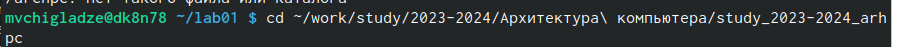{#fig:001 width=70%}

Проверим какие изменения были проделаны, тем самым подвердим добавление отчета в нужный каталог (Рис. 18)

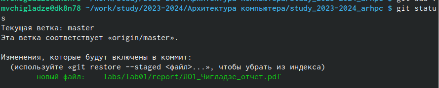{#fig:001 width=70%}

Сохраним изменения нужного нам файла командой git add. Зафиксируем все сохраненные изменения и дадим им название “Лаба 1”, командой git commit. Чтобы сохраненные изменени вывести за локальный репозиторий в github используем команду git push (Рис. 19).

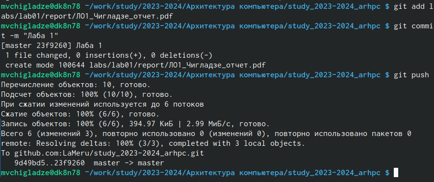{#fig:001 width=70%}

Теперь проверим загрузку, зайдя на github.com (Рис 20, 21). Отчет загрузился. Такие же манипуляции будут проделаны и с данным отчетом.

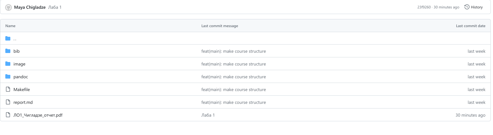{#fig:001 width=70%}

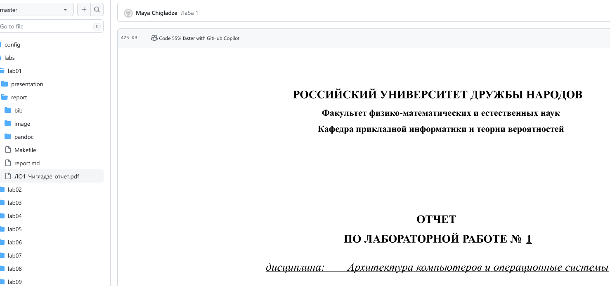{#fig:001 width=70%}

# **Выводы**

Результатом лабораторной работы является изучение идеологии и применение средств контроля версий. Приобретение практических навыков по работе с системой git.

# Список литературы{.unnumbered}

::: {#refs}
:::
