---
## Front matter
title: "Отчет по лабораторной работе #3"
subtitle: "Простейший вариант"
author: "Чигладзе Майя Владиславовна"

## Generic otions
lang: ru-RU
toc-title: "Содержание"

## Bibliography
bibliography: bib/cite.bib
csl: pandoc/csl/gost-r-7-0-5-2008-numeric.csl

## Pdf output format
toc: true # Table of contents
toc-depth: 2
lof: true # List of figures
lot: true # List of tables
fontsize: 12pt
linestretch: 1.5
papersize: a4
documentclass: scrreprt
## I18n polyglossia
polyglossia-lang:
  name: russian
  options:
	- spelling=modern
	- babelshorthands=true
polyglossia-otherlangs:
  name: english
## I18n babel
babel-lang: russian
babel-otherlangs: english
## Fonts
mainfont: PT Serif
romanfont: PT Serif
sansfont: PT Sans
monofont: PT Mono
mainfontoptions: Ligatures=TeX
romanfontoptions: Ligatures=TeX
sansfontoptions: Ligatures=TeX,Scale=MatchLowercase
monofontoptions: Scale=MatchLowercase,Scale=0.9
## Biblatex
biblatex: true
biblio-style: "gost-numeric"
biblatexoptions:
  - parentracker=true
  - backend=biber
  - hyperref=auto
  - language=auto
  - autolang=other*
  - citestyle=gost-numeric
## Pandoc-crossref LaTeX customization
figureTitle: "Рис."
tableTitle: "Таблица"
listingTitle: "Листинг"
lofTitle: "Список иллюстраций"
lotTitle: "Список таблиц"
lolTitle: "Листинги"
## Misc options
indent: true
header-includes:
  - \usepackage{indentfirst}
  - \usepackage{float} # keep figures where there are in the text
  - \floatplacement{figure}{H} # keep figures where there are in the text
---

# **Цель работы**

Цель данной работы заключается в освоении процедуры создания отчетов, используя Markdown – удобный язык разметки.

# **Выполнение лабораторной работы **

## Задание №1.
Открыли терминал (Рис. 1)

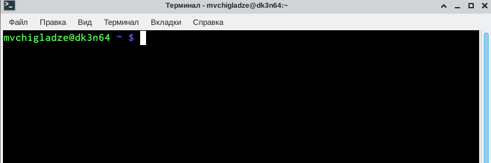{#fig:001 width=70%}

## Задание №2.
Перешли в каталог курса сформированный при выполнении лабораторной работы #2, используя команду cd (Рис. 2).
Обновили локальный репозиторий, скачав изменения из удаленного репозитория с помощью команды git pull (Рис. 2), все актуально.

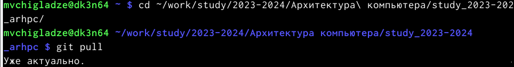{#fig:001 width=70%}

## Задание №3.
Перешли в каталог с шаблоном отчета по лабораторной работе №3 (Рис. 3)

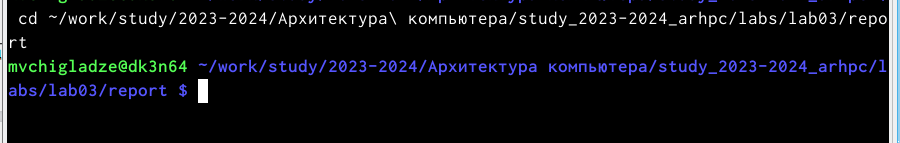{#fig:001 width=70%}

## Задание №4.
Проведем компиляцию шаблона с использованием Makefile. Для этого введем команду make (Рис. 4). 

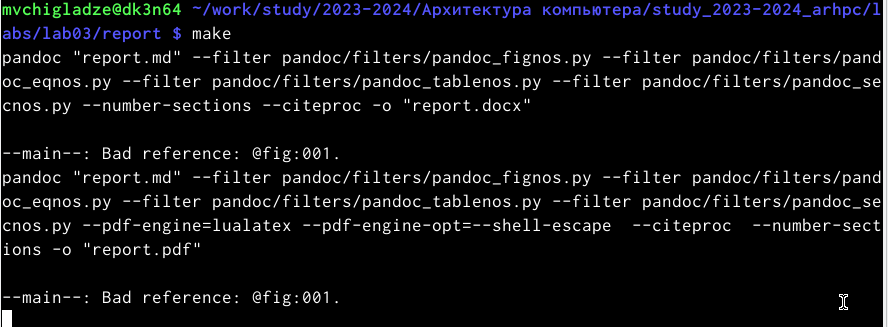{#fig:001 width=70%}

Сгенерировались файлы report.pdf и report.docx, что доказывает их появление в папке (Рис. 5).

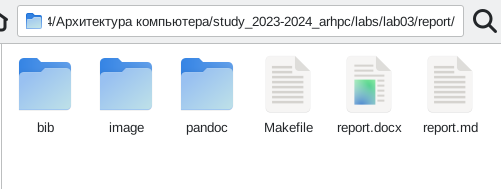{#fig:001 width=70%}

## Задание №5.
Удалим полученный файл с использованием Makefile, с использованием команды make clean (Рис. 6)

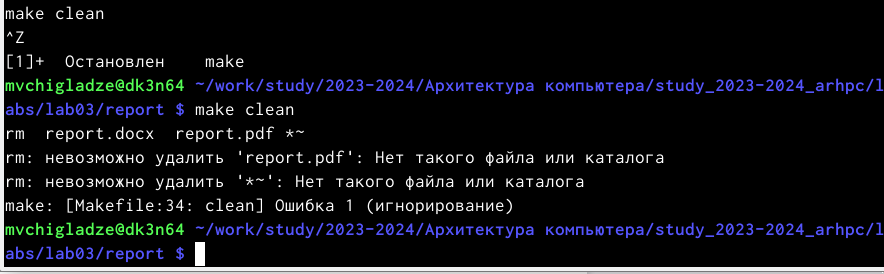{#fig:001 width=70%}

Проверим удаление файла в папке (Рис. 7).

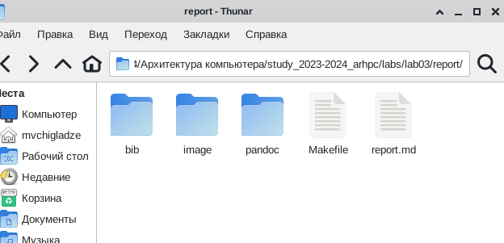{#fig:001 width=70%}

## Задание №6.
Откроем файл report.md c помощью текстового редактора gedit (Рис. 8).

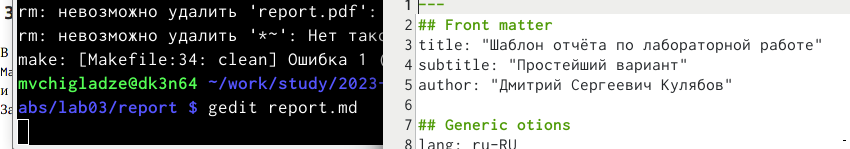{#fig:001 width=70%}

Задания 7, 8 лабораторной работы соотвествуют заданиям самостоятельной работы, так что все последующие действия будут представлены в следующем разделе.

# **Задание для самостоятельной работы.**

 В соответствующем каталоге создадим отчёт по лабораторной работе № 2 в формате Markdown. Отчет создадим 3 форматах: pdf, docx и md (Рис. 9 и 10).
 
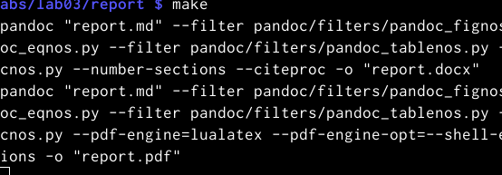{#fig:001 width=70%}

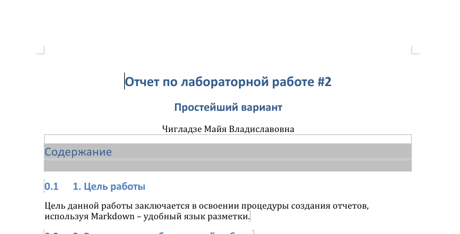{#fig:001 width=70%}

 Загружаем файлы на github. Сначала добавляем и проверяем статус (Рис. 11), далее коммитим (Рис. 12) и пушим (Рис. 13).
 
 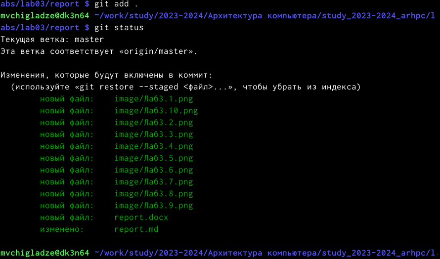{#fig:001 width=70%}
 
 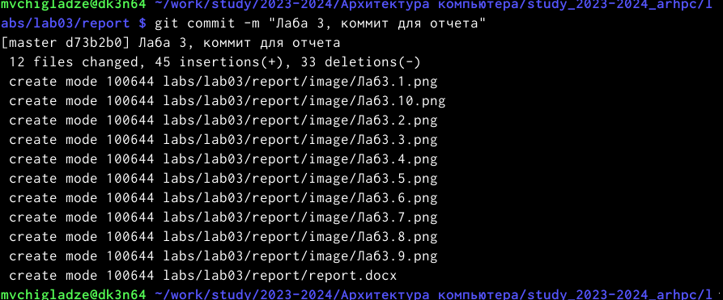{#fig:001 width=70%}
 
 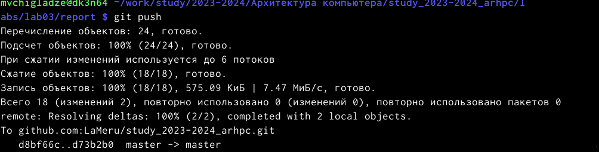{#fig:001 width=70%}
 

# **Выводы**

Результатом данной лабораторной работы, является освоение процедуры создания отчетов, используя Markdown – удобный язык разметки.

# Список литературы{.unnumbered}

::: {#refs}
:::
