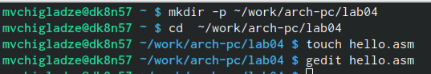
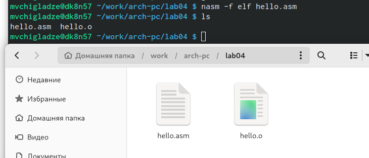
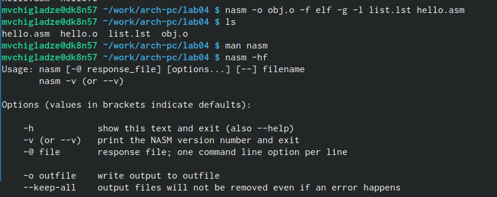
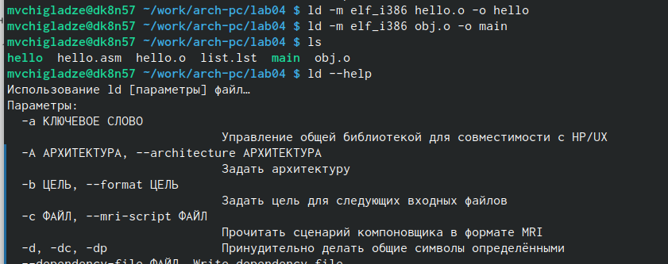
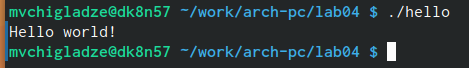
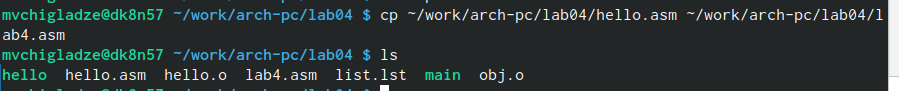

---
## Front matter
title: "Отчет по лабораторной работе №4"
subtitle: "Простейший вариант"
author: "Чигладзе Майя Владиславовна"

## Generic otions
lang: ru-RU
toc-title: "Содержание"

## Bibliography
bibliography: bib/cite.bib
csl: pandoc/csl/gost-r-7-0-5-2008-numeric.csl

## Pdf output format
toc: true # Table of contents
toc-depth: 2
lof: true # List of figures
lot: true # List of tables
fontsize: 12pt
linestretch: 1.5
papersize: a4
documentclass: scrreprt
## I18n polyglossia
polyglossia-lang:
  name: russian
  options:
	- spelling=modern
	- babelshorthands=true
polyglossia-otherlangs:
  name: english
## I18n babel
babel-lang: russian
babel-otherlangs: english
## Fonts
mainfont: PT Serif
romanfont: PT Serif
sansfont: PT Sans
monofont: PT Mono
mainfontoptions: Ligatures=TeX
romanfontoptions: Ligatures=TeX
sansfontoptions: Ligatures=TeX,Scale=MatchLowercase
monofontoptions: Scale=MatchLowercase,Scale=0.9
## Biblatex
biblatex: true
biblio-style: "gost-numeric"
biblatexoptions:
  - parentracker=true
  - backend=biber
  - hyperref=auto
  - language=auto
  - autolang=other*
  - citestyle=gost-numeric
## Pandoc-crossref LaTeX customization
figureTitle: "Рис."
tableTitle: "Таблица"
listingTitle: "Листинг"
lofTitle: "Список иллюстраций"
lotTitle: "Список таблиц"
lolTitle: "Листинги"
## Misc options
indent: true
header-includes:
  - \usepackage{indentfirst}
  - \usepackage{float} # keep figures where there are in the text
  - \floatplacement{figure}{H} # keep figures where there are in the text
---

# **Цель работы**

Изучение процесса компиляции и сборки программ, написанных с использованием ассемблера NASM

# **Порядок выполнения лабораторной работы**

## Программа Hello world!

Создадим новый каталог и перейдем в него. В нем создадим тектовый файла формата asm и откроем его (Рисунок 1)

{#fig:001 width=70%}

Введем в него нужный текст, соблюдая строки и регистр (Рисунок 2).

{#fig:001 width=70%}

## Транслятор NASM

С помощью NASM превратим текст программы в объектный код и проверим созданный файл, командой ls (Рисунок 3). Новое имя объектного файла - hello.o. Ключ -f указывает транслятору, что требуется создать бинарные файлы в формате ELF.

{#fig:001 width=70%}

## Расширенный синтаксис командной строки NASM

Первой командой на Рисунке 4 мы скомпилировали исходный файл hello.asm в obj.o (опция -o позволяет задать имя объектного файла, в данном случае obj.o), при этом формат выходного файла стал elf, и в него были включены символы для отладки (опция -g), кроме того, был создан файл листинга list.lst (опция -l) (Рисунок 4). 
С помощью ls проверили создание файлов, а также узнали подробную информацию о nasm и получили список форматов объектного файла (Рис. 4).

{#fig:001 width=70%}

## Компоновщик LD

Передаем файл на обработку компоновщику и выполнняем проверку созданных файлов (Рисунок 5). Исполняемый файл - main, объектный файл - obj.o. Также посмотрим на формат командной строки.

{#fig:001 width=70%}

## Запуск исполняемого файла 

Запустим на выполнение созданный исполняемый файл, находящийся в текущем каталоге (Рисунок 6).

{#fig:001 width=70%}

# **Задание для самостоятельной работы**

## Задание 1

Скопируем файл hello.asm в эту же директорию, но с названием lab4.asm и проверим (Рисунок 7).

{#fig:001 width=70%}

## Задание 2

## Задание 3

## Задание 4

{#fig:001 width=70%}

# **Выводы**

Здесь кратко описываются итоги проделанной работы.

# Список литературы{.unnumbered}

::: {#refs}
:::
