---
## Front matter
title: "Отчет по лабораторной работе №5"
subtitle: "Простейший вариант"
author: "Чигладзе Майя Владиславовна"

## Generic otions
lang: ru-RU
toc-title: "Содержание"

## Bibliography
bibliography: bib/cite.bib
csl: pandoc/csl/gost-r-7-0-5-2008-numeric.csl

## Pdf output format
toc: true # Table of contents
toc-depth: 2
lof: true # List of figures
lot: true # List of tables
fontsize: 12pt
linestretch: 1.5
papersize: a4
documentclass: scrreprt
## I18n polyglossia
polyglossia-lang:
  name: russian
  options:
	- spelling=modern
	- babelshorthands=true
polyglossia-otherlangs:
  name: english
## I18n babel
babel-lang: russian
babel-otherlangs: english
## Fonts
mainfont: PT Serif
romanfont: PT Serif
sansfont: PT Sans
monofont: PT Mono
mainfontoptions: Ligatures=TeX
romanfontoptions: Ligatures=TeX
sansfontoptions: Ligatures=TeX,Scale=MatchLowercase
monofontoptions: Scale=MatchLowercase,Scale=0.9
## Biblatex
biblatex: true
biblio-style: "gost-numeric"
biblatexoptions:
  - parentracker=true
  - backend=biber
  - hyperref=auto
  - language=auto
  - autolang=other*
  - citestyle=gost-numeric
## Pandoc-crossref LaTeX customization
figureTitle: "Рис."
tableTitle: "Таблица"
listingTitle: "Листинг"
lofTitle: "Список иллюстраций"
lotTitle: "Список таблиц"
lolTitle: "Листинги"
## Misc options
indent: true
header-includes:
  - \usepackage{indentfirst}
  - \usepackage{float} # keep figures where there are in the text
  - \floatplacement{figure}{H} # keep figures where there are in the text
---

# **Цель работы**

Изучение инструкций языка ассемблера mov и int в процессе освоения практичных навыков работы с Midnight Commander.

# **Порядок выполнения лабораторной работы**

## Задание 1

Откроем Midnight Commander (рис. [@fig:001])

{#fig:001 width=70%}

## Задание 2

Пользуясь клавишами ↑ , ↓ и Enter перейдем в каталог ~/work/arch-pc, созданный
при выполнении лабораторной работы №4 (рис. [@fig:002])

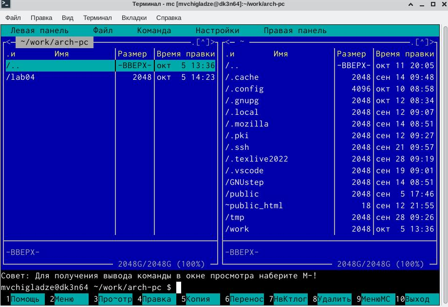{#fig:002 width=70%}

## Задание 3

С помощью функциональной клавиши F7 создадим папку lab05 (рис. [@fig:003]) и перейдем
в созданный каталог (рис. [@fig:004])

{#fig:003 width=70%}

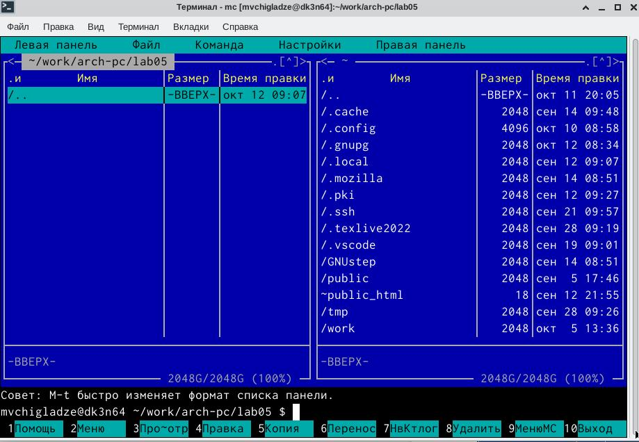{#fig:004 width=70%}

## Задание 4

Пользуясь строкой ввода и командой touch создадим файл lab5-1.asm (рис. [@fig:005])

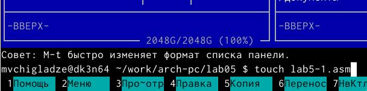{#fig:005 width=70%}

## Задание 5

С помощью функциональной клавиши F4 откроем файл lab5-1.asm для редактирова-
ния во встроенном редакторе (рис. [@fig:006])

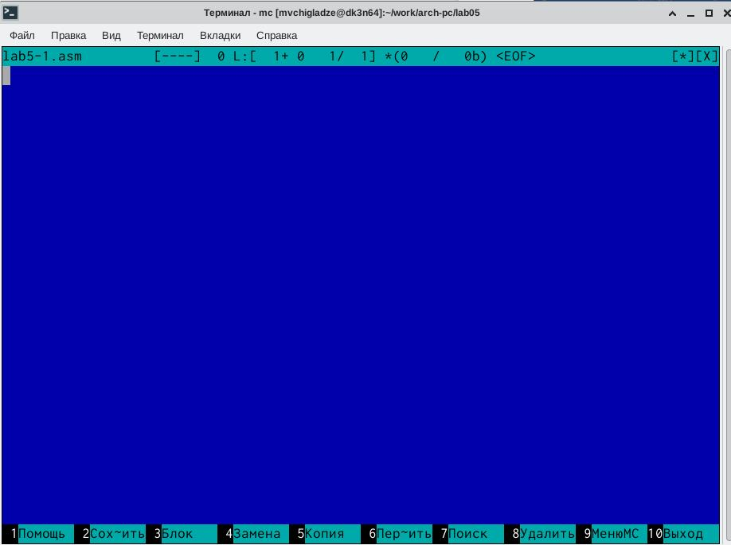{#fig:006 width=70%}

## Задание 6

Введем текст программы из листинга, сохраним изменения и закроем файл (рис. [@fig:007])

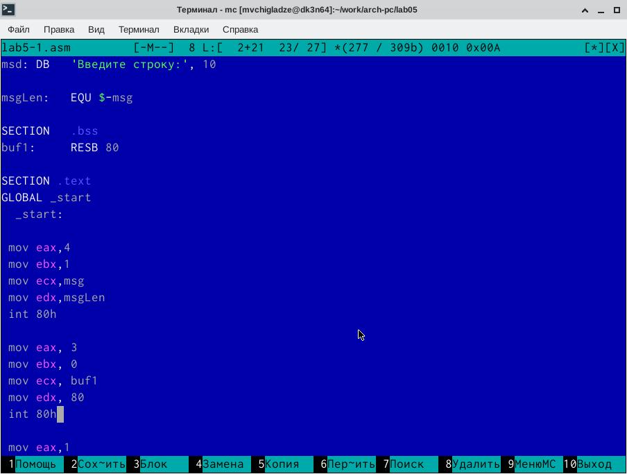{#fig:007 width=70%}

## Задание 7

С помощью функциональной клавиши F3 откроем файл lab5-1.asm для просмотра.
Убедимся, что файл содержит текст программы (рис. [@fig:008])

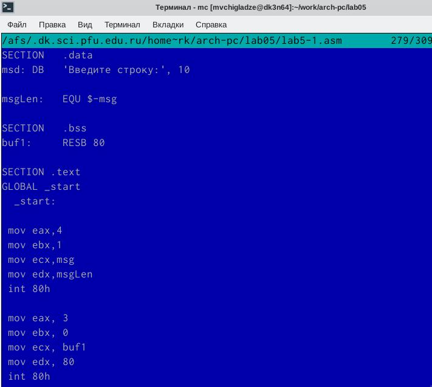{#fig:008 width=70%}

## Задание 8

Оттранслируем текст программы lab5-1.asm в объектный файл (рис. [@fig:009]).
Выполним компоновку объектного файла (рис. [@fig:010])  и запустим получившийся
исполняемый файл (рис. [@fig:011]). Программа выводит строку 'Введите строку:'
и ожидает ввода с клавиатуры. На запрос введу свои ФИО (рис. [@fig:012])

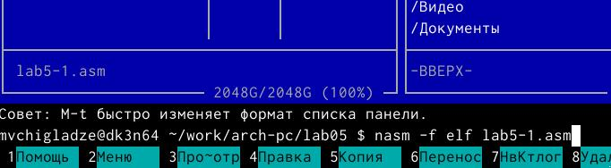{#fig:009 width=70%}

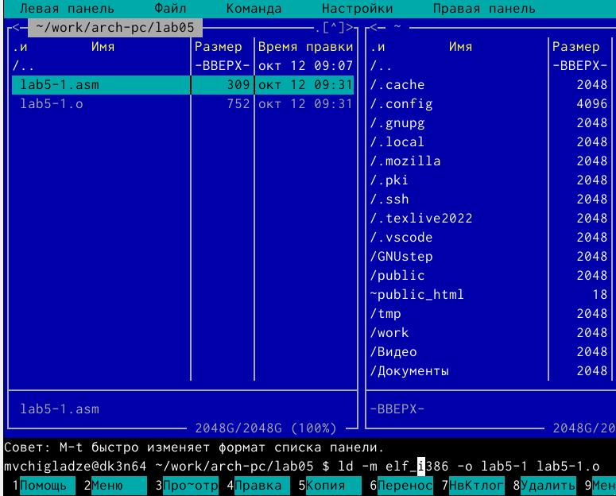{#fig:010 width=70%}

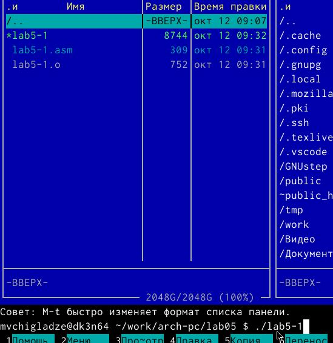{#fig:011 width=70%}

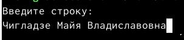{#fig:012 width=70%}

# **Подключение внешнего файла in_out.asm**

## Задание 9

Скачаем файл in_out.asm со страницы курса в ТУИС (рис. [@fig:013])

{#fig:013 width=70%}

## Задание 10

Копируем подключаемый файл in_out.asm в каталог lab05 (рис. [@fig:014])

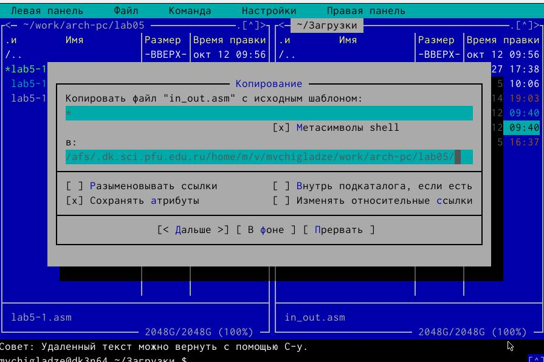{#fig:014 width=70%}

## Задание 11

С помощью функциональной клавиши F6 создам копию файла lab5-1.asm с именем
lab5-2.asm (рис. [@fig:015])

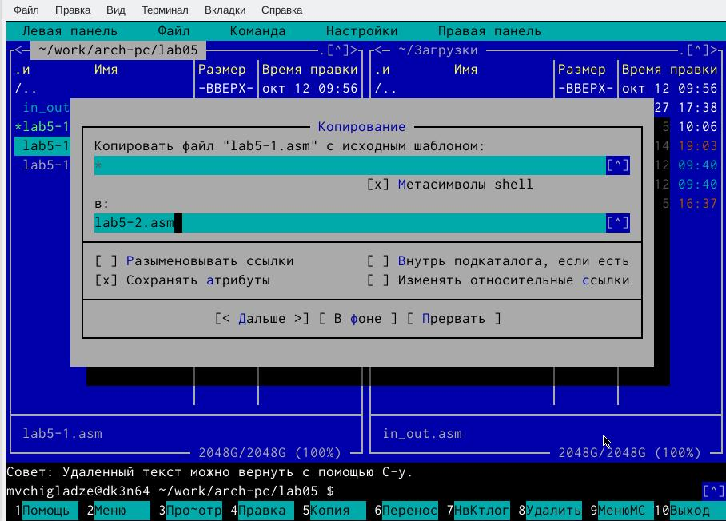{#fig:015 width=70%}

## Задание 12

Исправим текст программы в файле lab5-2.asm с использованием подпрограмм из внешнего
файла in_out.asm в соответствии с листингом (рис. [@fig:016]). Создам испольняемый
файл и проверю его работу (рис. [@fig:017])

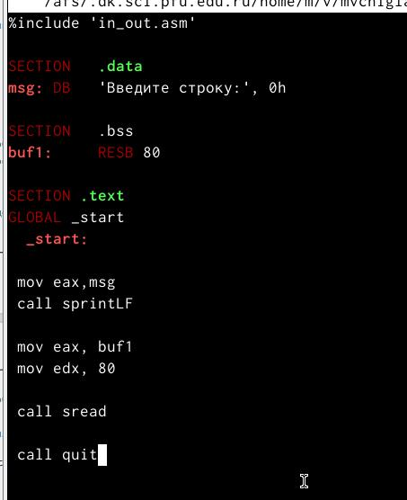{#fig:016 width=70%}

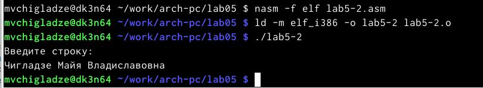{#fig:017 width=70%}

## Задание 13

В файле lab5-2.asm заменим подпрограмму sprintLF на sprint (рис. [@fig:018]). Создадим исполняемый файл 
и проверим его работу (рис. [@fig:019]). Разница состоит в отступе после заранее написанной фразы и нашим вводом

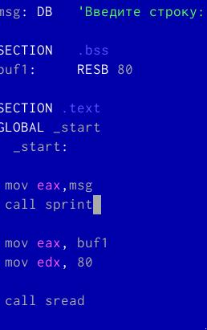{#fig:018 width=70%}

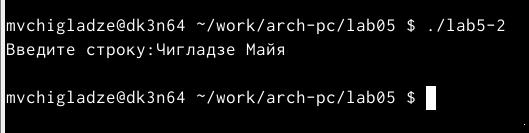{#fig:019 width=70%}

# **Задание для самостоятельной работы**

## Задание 1

Создадим копию файла lab5-1.asm и назовем lab5-3.asm (рис. [@fig:020]). 
Внесем изменения в программу (без использования внешнего файла in_out.asm), 
так чтобы она работала по определенному алгоритму 

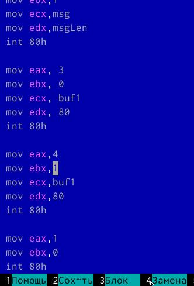{#fig:020 width=70%}

## Задание 2

Получим исполняемый файл и проверим его работу. На приглашение ввести строку
введу свою фамилию (рис. [@fig:021]).

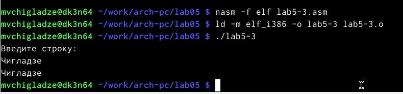{#fig:021 width=70%}

## Задание 3

Создадим копию файла lab5-2.asm и назовем lab5-4.asm. Исправим текст программы с использование
подпрограмм из внешнего файла in_out.asm, так чтобы она работала по заданному алгоритму (рис. [@fig:022]).

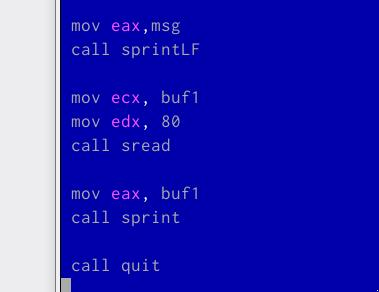{#fig:022 width=70%}

## Задание 4

Создадим исполняемый файл и проверим его работу (рис. [@fig:023]).

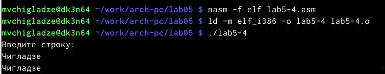{#fig:023 width=70%}

# **Выводы**

В ходе лабораторной работы, я изучила инструкций языка ассемблера mov и int в процессе освоения практичных навыков работы с Midnight Commander.

# Список литературы{.unnumbered}

::: {#refs}
:::
