---
## Front matter
title: "Отчет по лабораторной работе №6"
subtitle: "Простейший вариант"
author: "Чигладзе Майя Владиславовна"

## Generic otions
lang: ru-RU
toc-title: "Содержание"

## Bibliography
bibliography: bib/cite.bib
csl: pandoc/csl/gost-r-7-0-5-2008-numeric.csl

## Pdf output format
toc: true # Table of contents
toc-depth: 2
lof: true # List of figures
lot: true # List of tables
fontsize: 12pt
linestretch: 1.5
papersize: a4
documentclass: scrreprt
## I18n polyglossia
polyglossia-lang:
  name: russian
  options:
	- spelling=modern
	- babelshorthands=true
polyglossia-otherlangs:
  name: english
## I18n babel
babel-lang: russian
babel-otherlangs: english
## Fonts
mainfont: PT Serif
romanfont: PT Serif
sansfont: PT Sans
monofont: PT Mono
mainfontoptions: Ligatures=TeX
romanfontoptions: Ligatures=TeX
sansfontoptions: Ligatures=TeX,Scale=MatchLowercase
monofontoptions: Scale=MatchLowercase,Scale=0.9
## Biblatex
biblatex: true
biblio-style: "gost-numeric"
biblatexoptions:
  - parentracker=true
  - backend=biber
  - hyperref=auto
  - language=auto
  - autolang=other*
  - citestyle=gost-numeric
## Pandoc-crossref LaTeX customization
figureTitle: "Рис."
tableTitle: "Таблица"
listingTitle: "Листинг"
lofTitle: "Список иллюстраций"
lotTitle: "Список таблиц"
lolTitle: "Листинги"
## Misc options
indent: true
header-includes:
  - \usepackage{indentfirst}
  - \usepackage{float} # keep figures where there are in the text
  - \floatplacement{figure}{H} # keep figures where there are in the text
---

# **Цель работы**

Освоение навыков работы с арифметическими командами в языке ассемблера NASM

# **Порядок выполнения лабораторной работы**

## Символьные и численные данные в NASM

Создадим каталог для программам лабораторной работы No 6, перейдем в него и
создадим файл lab6-1.asm (рис. [@fig:001])

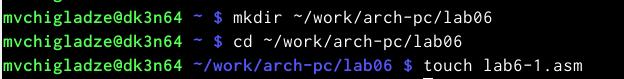{#fig:001 width=70%}

## Задание 2

Рассмотрим примеры программ вывода символьных и численных значений. Програм-
мы будут выводить значения записанные в регистр eax. Заполняем файл
по листингу (рис. [@fig:002]), и создаем и запускаем исполняемый файл (рис. [@fig:003])

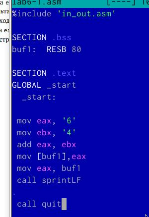{#fig:002 width=70%}

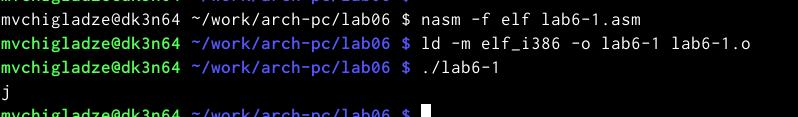{#fig:003 width=70%}

## Задание 3

Далее изменим текст программы и вместо символов, запишем в регистры числа, 
замените строки (рис. [@fig:004]) и запустим исполняемый файл (рис. [@fig:005])
Символ не отображается, потому что это отступ строки

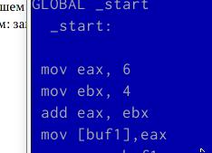{#fig:004 width=70%}

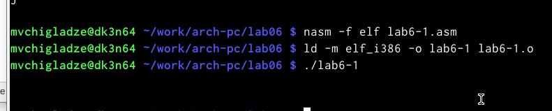{#fig:005 width=70%}

При замене printLF на print будет всего 1 отступ

## Задание 4

Создадим файл lab6-2.asm в каталоге ~/work/arch-pc/lab06 (рис. [@fig:006]) и 
введем в него текст программы из листинга 6.2
В результате работы программы мы получим число 106 (рис. [@fig:007]). 
В данном случае, как и в первом, команда add складывает коды символов ‘6’ и ‘4’ 
(54+52=106). Однако, в отличии от программы из листинга 6.1, функция iprintLF 
позволяет вывести число, а не символ, кодом которого является это число

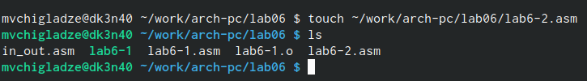{#fig:006 width=70%}

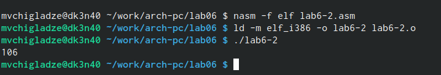{#fig:007 width=70%}

## Задание 5

Далее изменим текст программы запишем в регистры числа, и запустим исполняемый 
файл (рис. [@fig:008]). У нас сложилось два числа, а не числа с этим кодом.

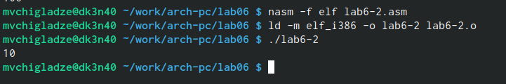{#fig:008 width=70%}

При замене printLF на print отступа не будет (рис. [@fig:009]).

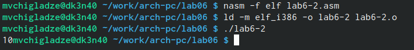{#fig:009 width=70%}

## Задание 6

Создадим файл lab6-3.asm в каталоге ~/work/arch-pc/lab06 (рис. [@fig:010]) и 
введем в него текст программы из листинга 6.3
В результате работы программы мы получим нужные нам фразы 6 (рис. [@fig:011]). 

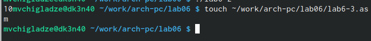{#fig:010 width=70%}

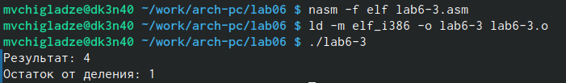{#fig:011 width=70%}

Далее изменим текст программы (рис. [@fig:012]), и запустим исполняемый 
файл (рис. [@fig:013]). Арифметические операции выполнены корректно

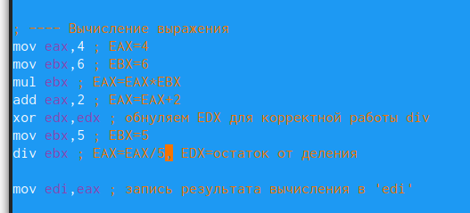{#fig:012 width=70%}

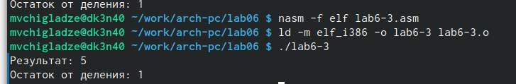{#fig:013 width=70%}

## Задание 7

Создадим файл variant.asm в каталоге ~/work/arch-pc/lab06 (рис. [@fig:014]) и 
введем в него текст программы из листинга 6.4
В результате работы программы мы получим нужные ввод с консоли и определение 
варианта (рис. [@fig:015]). 

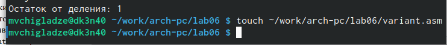{#fig:014 width=70%}

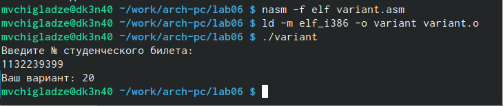{#fig:015 width=70%}

# **Ответы на вопросы**

1. Какие строки листинга 6.4 отвечают за вывод на экран сообщения ‘Ваш вариант:’?

Ответ:
rem: DB 'Ваш вариант: ',0
mov eax,rem
call sprint

2. Для чего используется следующие инструкции?
mov ecx, x
mov edx, 80
call sread

Ответ:
Запись адреса переменной x в `EAX`; запись длины вводимого сообщения в `EBX`;вызов подпрограммы ввода сообщения

3. Для чего используется инструкция “call atoi”?

Ответ:
Ввод с клавиатуры осуществляется в символьном виде и для корректной работы арифметических операций в NASM символы необходимо преобразовать в числа. Для этого может быть использована функция atoi.

4. Какие строки листинга 6.4 отвечают за вычисления варианта?

Ответ:
xor edx,edx
mov ebx,20
div ebx
inc edx

5. В какой регистр записывается остаток от деления при выполнении инструкции “div ebx”?

Ответ:
Результат будет записан в регистр EAX, а остаток в регистр EDX

6. Для чего используется инструкция “inc edx”?

Ответ:
Инструкция INC используется для увеличения операнда на единицу

7. Какие строки листинга 6.4 отвечают за вывод на экран результата вычислений?

Ответ: mov eax,edx - вызов подпрограммы печати значения; call iprintLF - из 'edx' (остаток) в виде символов

# **Задание для самостоятельной работы**

## Задание 1

Написать программу вычисления выражения y=f(x). Программа должна выводить
выражение для вычисления, выводить запрос на ввод значения x, вычислять задан-
ное выражение в зависимости от введенного x, выводить результат вычислений. Вид
функции f(x) выбрать из таблицы 6.3 вариантов заданий в соответствии с номером
полученным при выполнении лабораторной работы (Мой номер 20). Создайте исполняемый файл и
проверьте его работу для значений x1 и x2 из 6.3.
Моя функция: x^3*1/3+21
Я обнулила переменную ebx, записала в нее eax, умножила 2 раза, для получения 3 степени, обнулила edx,
записала в ebx - 3, разделила на ebx, добавила 21 (рис. [@fig:016] и рис. [@fig:017]).

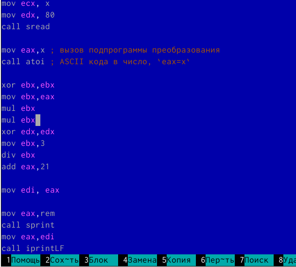{#fig:016 width=70%}

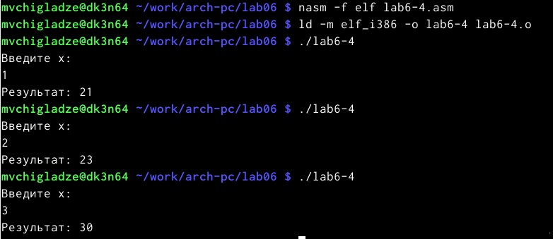{#fig:017 width=70%}

# **Выводы**

В ходе лабораторной работы, я освоила навыки работы с арифметическими командами в языке ассемблера NASM.

# Список литературы{.unnumbered}

::: {#refs}
:::
