---
## Front matter
title: "Отчет по лабораторной работе №7"
subtitle: "Простейший вариант"
author: "Чигладзе Майя Владиславовна"

## Generic otions
lang: ru-RU
toc-title: "Содержание"

## Bibliography
bibliography: bib/cite.bib
csl: pandoc/csl/gost-r-7-0-5-2008-numeric.csl

## Pdf output format
toc: true # Table of contents
toc-depth: 2
lof: true # List of figures
lot: true # List of tables
fontsize: 12pt
linestretch: 1.5
papersize: a4
documentclass: scrreprt
## I18n polyglossia
polyglossia-lang:
  name: russian
  options:
	- spelling=modern
	- babelshorthands=true
polyglossia-otherlangs:
  name: english
## I18n babel
babel-lang: russian
babel-otherlangs: english
## Fonts
mainfont: PT Serif
romanfont: PT Serif
sansfont: PT Sans
monofont: PT Mono
mainfontoptions: Ligatures=TeX
romanfontoptions: Ligatures=TeX
sansfontoptions: Ligatures=TeX,Scale=MatchLowercase
monofontoptions: Scale=MatchLowercase,Scale=0.9
## Biblatex
biblatex: true
biblio-style: "gost-numeric"
biblatexoptions:
  - parentracker=true
  - backend=biber
  - hyperref=auto
  - language=auto
  - autolang=other*
  - citestyle=gost-numeric
## Pandoc-crossref LaTeX customization
figureTitle: "Рис."
tableTitle: "Таблица"
listingTitle: "Листинг"
lofTitle: "Список иллюстраций"
lotTitle: "Список таблиц"
lolTitle: "Листинги"
## Misc options
indent: true
header-includes:
  - \usepackage{indentfirst}
  - \usepackage{float} # keep figures where there are in the text
  - \floatplacement{figure}{H} # keep figures where there are in the text
---

# **Цель работы**

Изучение команд условного и безусловного переходов. Приобретение навыков написания программ с использованием переходов. Знакомство с назначением и структурой файла
листинга.

# **Порядок выполнения лабораторной работы**

## Реализация переходов в NASM

### Задание 1

Создадим каталог для программам лабораторной работы No 7, перейдем в него и
создадим файл lab6-7.asm (рис. [@fig:001])

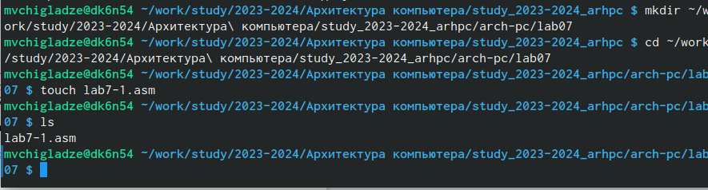{#fig:001 width=70%}

### Задание 2

Заполняем файл по листингу (рис. [@fig:002]), и создаем и запускаем исполняемый файл (рис. [@fig:003])

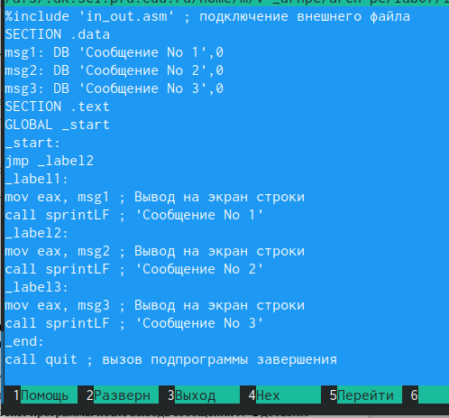{#fig:002 width=70%}

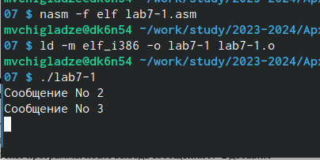{#fig:003 width=70%}

Изменим порядок запуска с помощью команд, заполним файл по листингу (рис. [@fig:004]), и запускаем исполняемый файл (рис. [@fig:005])

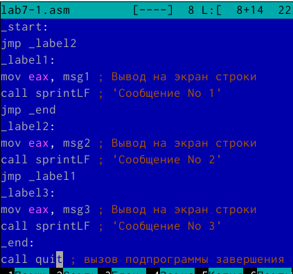{#fig:004 width=70%}

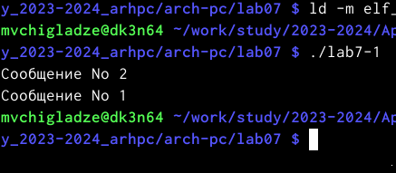{#fig:005 width=70%}

Изменим порядок запуска с помощью команд, добавив после старта прыжок к 3, а у 3 прыжок ко 2 (рис. [@fig:006]), и запускаем исполняемый файл (рис. [@fig:007])

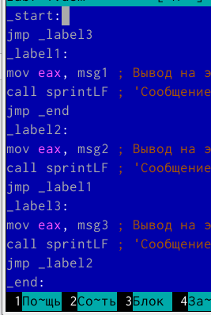{#fig:006 width=70%}

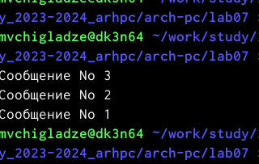{#fig:007 width=70%}

## Задание 3

Создаем файл asm командой touch, заполняем по листингу 7.3 и запускаем исполняемый файл (рис. [@fig:008])

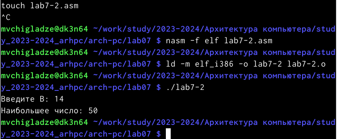{#fig:008 width=70%}

## Задание 4

Создам файл листинга для программы из файла lab7-2.asm
Открою файл листинга lab7-2.lst с помощью любого текстового редактора
mcedit lab7-2.lst (рис. [@fig:009])
Подробно объясню содержимое трёх строк файла листинга (рис. [@fig:010]).
Строка 21 - мы записываем в переменную eax значение переменной B
Строка 22 - преобразуем из вида строки в числовой вид
Строка 23 - Записываем полученное обратно в число B
Открою файл с программой lab7-2.asm и удалю операнд B (рис. [@fig:011]).
Выполню трансляцию с получением файла листинга, получилась ошибка, которая записалась в листинге (рис. [@fig:012]).

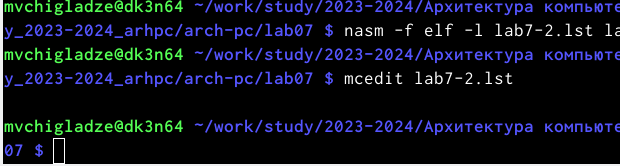{#fig:009 width=70%}

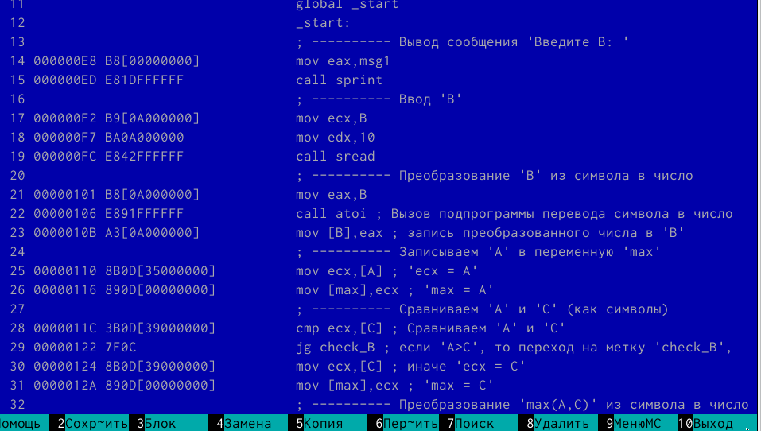{#fig:010 width=70%}

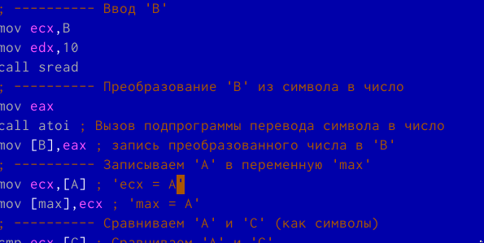{#fig:011 width=70%}

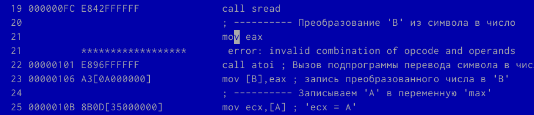{#fig:012 width=70%}

# **Задание для самостоятельной работы**

## Задание 1

Написала программу нахождения наименьшей из 3 целочисленных переменных 𝑎,𝑏 и с. 
Значения переменных 92, 2, 61 (рис. [@fig:013]). 
Создам исполняемый файл и проверю его работу (рис. [@fig:014]).

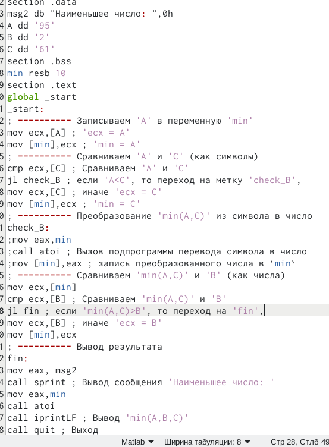{#fig:013 width=70%}

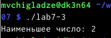{#fig:014 width=70%}

## Задание 2

Напиcала программу, которая для введенных с клавиатуры значений 𝑥 и 𝑎 вычисляет значение заданной функции 𝑓(𝑥) и выводит результат вычислений. Моя система в варианте 20.
Ввела данные по заданию варианты значений и их результат (рис. [@fig:015]).
Мой код программы (рис. [@fig:016]). 
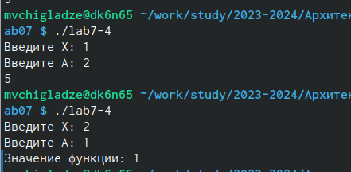{#fig:015 width=70%}

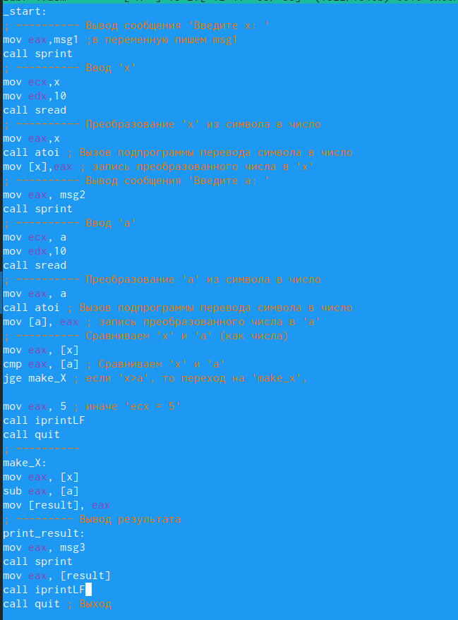{#fig:016 width=70%}

# **Выводы**

В ходе лабораторной работы, я изучила команды условного и безусловного переходов. Приобрела навыки написания программ с использованием переходов. Позанкомилась с назначением и структурой файла

# Список литературы{.unnumbered}

::: {#refs}
:::
