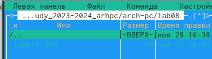
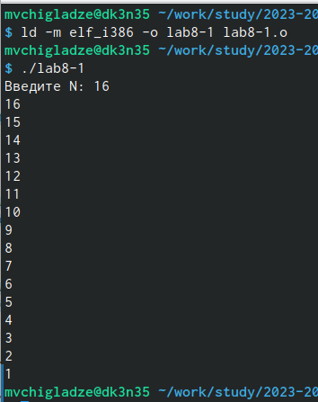
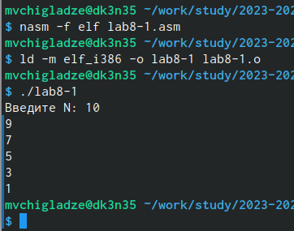
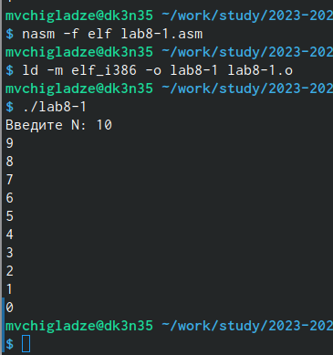
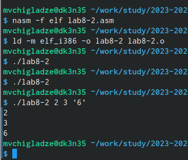
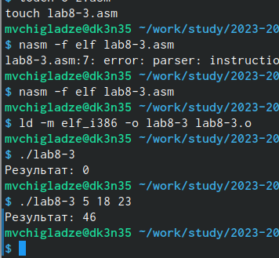
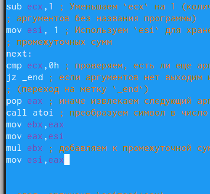
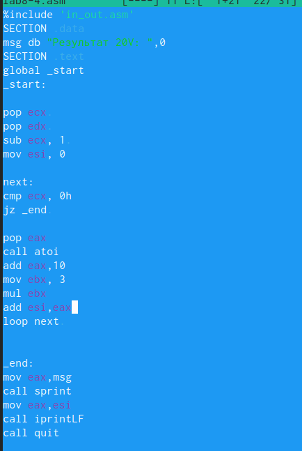
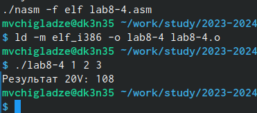

---
## Front matter
title: "Отчет по лабораторной работе №8"
subtitle: "Простейший вариант"
author: "Чигладзе Майя Владиславовна"

## Generic otions
lang: ru-RU
toc-title: "Содержание"

## Bibliography
bibliography: bib/cite.bib
csl: pandoc/csl/gost-r-7-0-5-2008-numeric.csl

## Pdf output format
toc: true # Table of contents
toc-depth: 2
lof: true # List of figures
lot: true # List of tables
fontsize: 12pt
linestretch: 1.5
papersize: a4
documentclass: scrreprt
## I18n polyglossia
polyglossia-lang:
  name: russian
  options:
	- spelling=modern
	- babelshorthands=true
polyglossia-otherlangs:
  name: english
## I18n babel
babel-lang: russian
babel-otherlangs: english
## Fonts
mainfont: PT Serif
romanfont: PT Serif
sansfont: PT Sans
monofont: PT Mono
mainfontoptions: Ligatures=TeX
romanfontoptions: Ligatures=TeX
sansfontoptions: Ligatures=TeX,Scale=MatchLowercase
monofontoptions: Scale=MatchLowercase,Scale=0.9
## Biblatex
biblatex: true
biblio-style: "gost-numeric"
biblatexoptions:
  - parentracker=true
  - backend=biber
  - hyperref=auto
  - language=auto
  - autolang=other*
  - citestyle=gost-numeric
## Pandoc-crossref LaTeX customization
figureTitle: "Рис."
tableTitle: "Таблица"
listingTitle: "Листинг"
lofTitle: "Список иллюстраций"
lotTitle: "Список таблиц"
lolTitle: "Листинги"
## Misc options
indent: true
header-includes:
  - \usepackage{indentfirst}
  - \usepackage{float} # keep figures where there are in the text
  - \floatplacement{figure}{H} # keep figures where there are in the text
---

# **Цель работы**

Приобретение навыков написания программ с использованием циклов и обработкой аргументов командной строки

# **Порядок выполнения лабораторной работы**

## Реализация переходов в NASM

### Задание 1

Создала каталог для программам лабораторной работы № 8, перешла в него и создала файл lab8-1.asm(рис. [@fig:001])

{#fig:001 width=70%}

Проверила его работу (рис. [@fig:002]). Данный пример показывает, что использование регистра ecx в теле цилка loop может привести к некорректной работе программы. Изменила текст программы добавив изменение значение регистра ecx в цикле (рис. [@fig:003]). Регистр ecx принемает нечетный значения, N не соответствует проходам цикла.

{#fig:002 width=70%}

{#fig:003 width=70%}

Для использования регистра ecx в цикле и сохранения корректности работы программы
можно использовать стек. Внесу изменения в текст программы добавив команды push
и pop (добавления в стек и извлечения из стека) для сохранения значения счетчика цикла
loop (рис. [@fig:004]). В данном случае N соотвествует проходам цикла.

{#fig:004 width=70%}

### Задание 2

Рассмотрим программу, которая выводит на экран аргументы командной строки. Создам файл lab8-2.asm в каталоге и введу в него текст программы из листинга 8.2. Создам исполняемый файл и запущу его, указав аргументы (рис. [@fig:005]). 3 аргумента было обработано программой.

{#fig:005 width=70%}

Рассмотрим еще один пример программы которая выводит сумму чисел, которые передаются в программу как аргументы. Создам файл lab8-3.asm в каталоге и введу в него текст программы из листинга 8.3 и запущу (рис. [@fig:006]).

{#fig:006 width=70%}

Изменю текст программы из листинга 8.3 для вычисления произведения аргументов
командной строки (рис. [@fig:007]). Поменяла значение esi на 1, чтобы произведение не превращалось в 0, в ebx вписала значение аргумента, в eax значение того что умножается, умножила на ebx eax, записала получение в esi.

{#fig:007 width=70%}

# **Задание для самостоятельной работы**

## Задание 1

Написала программу, которая находит сумму значений функции 𝑓(𝑥) для 𝑥 = 𝑥1, 𝑥2, ..., 𝑥𝑛, т.е. программа должна выводить значение 𝑓(𝑥1) + 𝑓(𝑥2) + ... + 𝑓(𝑥𝑛). Значения 𝑥𝑖 передаются как аргументы. Вид функции 𝑓(𝑥) выбрала из таблицы 8.1 В20. Создала исполняемый файл и проверьте его работу на нескольких наборах 𝑥 = 𝑥1, 𝑥2, ..., 𝑥𝑛.
Мой вариант: 3(10+x)
Код программы (рис. [@fig:008]) и исполнение программы (рис. [@fig:008]). Я создала промежуточную переменную еси, при итерации цикла, я добавляла 10, в ебикс записала 3, умножала еаикс на ебикс, добавляла полученное к нашей еси. В конце, в еаиск записала еси и вывела результат.

{#fig:007 width=70%}

{#fig:007 width=70%}

# **Выводы**

В ходе лабораторной работы, я приобрела навыки написания программ с использованием циклов и обработкой аргументов командной строки

# Список литературы{.unnumbered}

::: {#refs}
:::
