---
## Front matter
title: "Отчет по лабораторной работе №9"
subtitle: "Простейший вариант"
author: "Чигладзе Майя Владиславовна"

## Generic otions
lang: ru-RU
toc-title: "Содержание"

## Bibliography
bibliography: bib/cite.bib
csl: pandoc/csl/gost-r-7-0-5-2008-numeric.csl

## Pdf output format
toc: true # Table of contents
toc-depth: 2
lof: true # List of figures
lot: true # List of tables
fontsize: 12pt
linestretch: 1.5
papersize: a4
documentclass: scrreprt
## I18n polyglossia
polyglossia-lang:
  name: russian
  options:
	- spelling=modern
	- babelshorthands=true
polyglossia-otherlangs:
  name: english
## I18n babel
babel-lang: russian
babel-otherlangs: english
## Fonts
mainfont: PT Serif
romanfont: PT Serif
sansfont: PT Sans
monofont: PT Mono
mainfontoptions: Ligatures=TeX
romanfontoptions: Ligatures=TeX
sansfontoptions: Ligatures=TeX,Scale=MatchLowercase
monofontoptions: Scale=MatchLowercase,Scale=0.9
## Biblatex
biblatex: true
biblio-style: "gost-numeric"
biblatexoptions:
  - parentracker=true
  - backend=biber
  - hyperref=auto
  - language=auto
  - autolang=other*
  - citestyle=gost-numeric
## Pandoc-crossref LaTeX customization
figureTitle: "Рис."
tableTitle: "Таблица"
listingTitle: "Листинг"
lofTitle: "Список иллюстраций"
lotTitle: "Список таблиц"
lolTitle: "Листинги"
## Misc options
indent: true
header-includes:
  - \usepackage{indentfirst}
  - \usepackage{float} # keep figures where there are in the text
  - \floatplacement{figure}{H} # keep figures where there are in the text
---

# **Цель работы**

Приобретение навыков написания программ с использованием подпрограмм. Знакомство с методами отладки при помощи GDB и его основными возможностями.

# **Порядок выполнения лабораторной работы**

## Реализация подпрограмм в NASM

### Задание 1

Создала каталог для программам лабораторной работы № 9, перешла в него и создала файл lab9-1.asm(рис. [@fig:001])

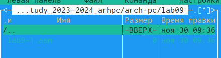{#fig:001 width=70%}

### Задание 2

Введу в файл lab09-1.asm текст программы из листинга 9.1. Создам исполняемый файл и проверю его работу (рис. [@fig:002])

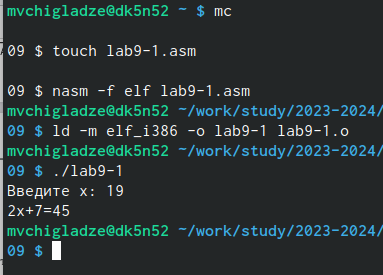{#fig:002 width=70%}

Изменю текст программы, добавив подпрограмму _subcalcul в подпрограмму _calcul, для вычисления выражения f(g(x)), где x вводится с клавиатуры, f(x) = 2x + 7, g(x) = 3x − 1. Т.е. x передается в подпрограмму _calcul из нее в подпрограмму _subcalcul, где вычисляется выражение g(x), результат возвращается в _calcul и вычисляется выражение f(g(x)). Результат возвращается в основную программу для вывода результата на экран. Код моей программы (рис. [@fig:003]) и результат выполнения(рис. [@fig:004]).

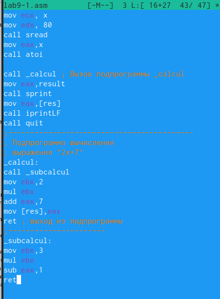{#fig:003 width=70%}

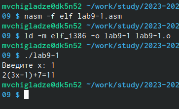{#fig:004 width=70%}

## Отладка программы с помощью GDB

### Задание 0

Введу в файл lab09-2.asm текст программы из листинга 9.2. Создам исполняемый файл и проверю его работу c использованием команды run (рис. [@fig:005])

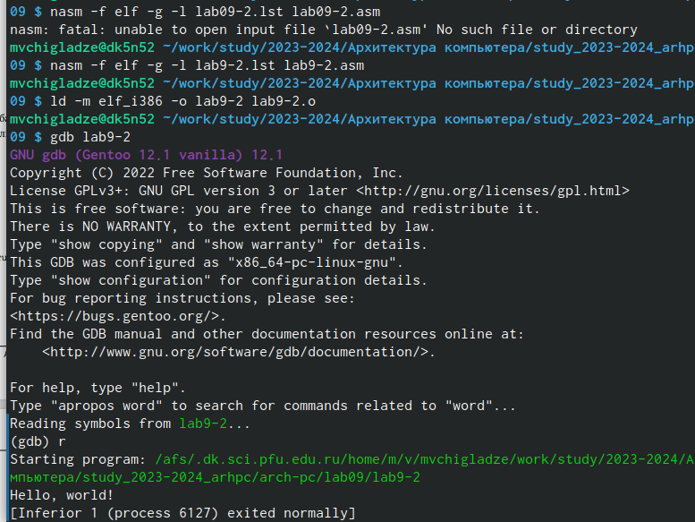{#fig:005 width=70%}

Посмотрю дисассимилированный код программы с помощью команды disassemble начиная с метки _start
(gdb) disassemble _start. Переключу на отображение команд с Intel’овским синтаксисом, введя команду set disassembly-flavor intel(рис. [@fig:006]).Наверное, главное отличие, это то что в ATT выводятся переменные, в которые все записывается, а в Intel размер переменных.

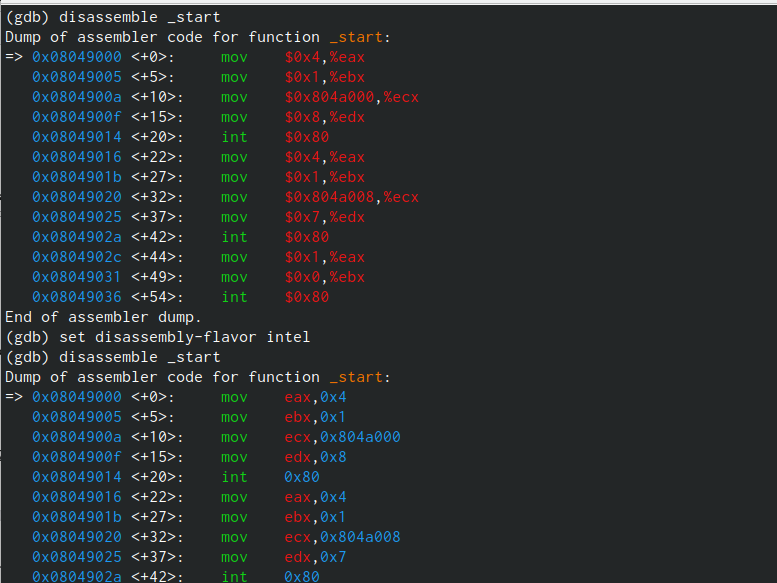{#fig:006 width=70%}

Включите режим псевдографики для более удобного анализа программы (рис. [@fig:007]) 

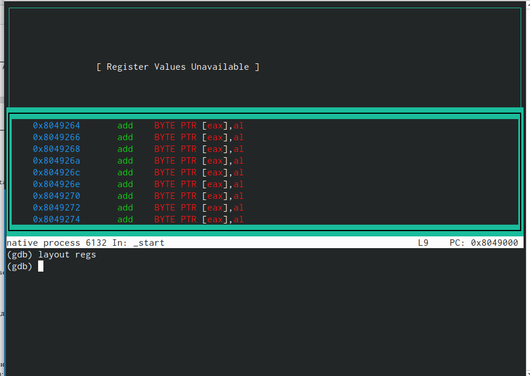{#fig:007 width=70%}

### Задание 1

Проверила текущие брейкпоинты и установила новый на предпоследней инструкции (рис. [@fig:008]) 

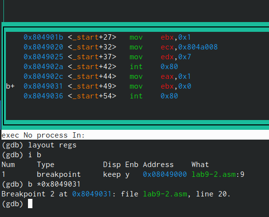{#fig:008 width=70%}

### Задание 2

Использовав команда si 5 раз,я наблюдала изменение значений первых 4-ех регистров eax ecx edx ebx (рис. [@fig:009]) 

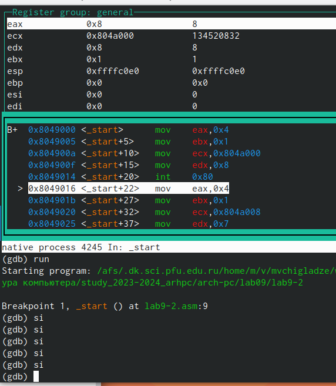{#fig:009 width=70%}

Смотрим значение переменной по имени и адресу (рис. [@fig:010]) 

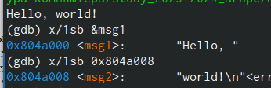{#fig:010 width=70%}

Замена символов в переменных (рис. [@fig:011]) 

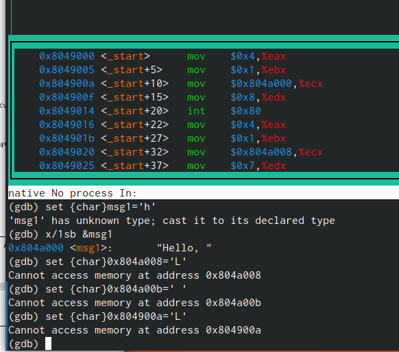{#fig:011 width=70%}

Использование команды print (рис. [@fig:012]). Используя команду p/s $ebx мы получим значение регистра 1.

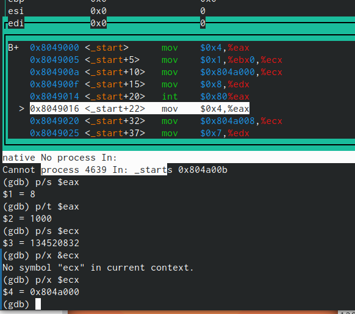{#fig:012 width=70%}

### Задание 3

Скопировала второй файл из 8 лабораторной работы в папку, создала исполняемый файл и запустили с аргументами (рис. [@fig:013]).

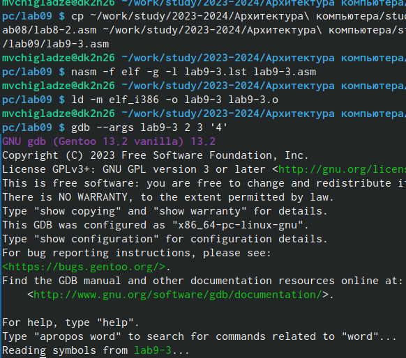{#fig:013 width=70%}

Смотрю что находится в переменных с разным адресом (рис. [@fig:014]). Шаг изменения адреса равен 4 из-за того сколько памяти выделяют на переменную.

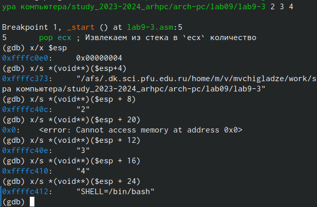{#fig:014 width=70%}

# **Задание для самостоятельной работы**

## Задание 1

Преобразовала программу из лабораторной работы №8 (Задание №1 для самостоятельной работы), реализовав вычисление значения функции 𝑓(𝑥) как подпрограмму(рис. [@fig:015]).

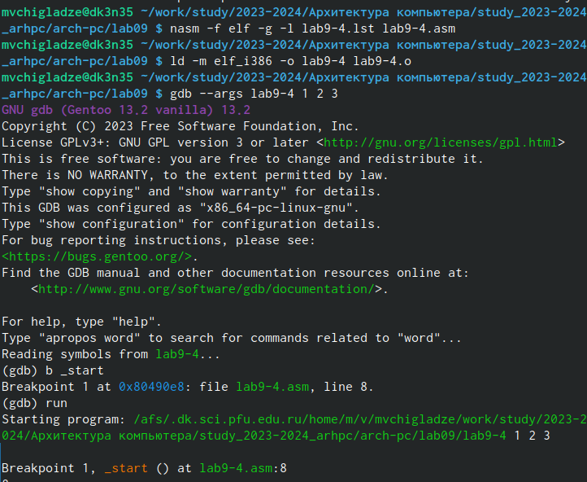{#fig:015 width=70%}

## Задание 2

В листинге 9.3 приведена программа вычисления выражения (3 + 2) ∗ 4 + 5. При запуске
данная программа дает неверный результат. Проверю это, выводит 10, должно 25 (рис. [@fig:016]). 

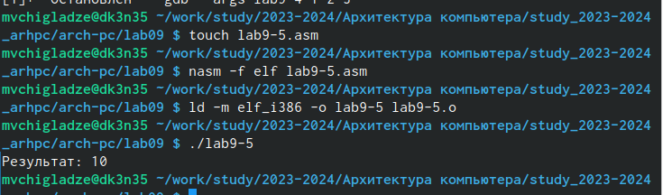{#fig:016 width=70%}

С помощью отладчика GDB, анализируя изменения значений регистров, определю ошибку и исправлю ее. Ошибка была в том, что используя команду mul, идет умножение на eax, а не то что мы хотим (ebx) (рис. [@fig:017]) (рис. [@fig:018]). Я исправила программу (рис. [@fig:019]) и запустила (рис. [@fig:020]).

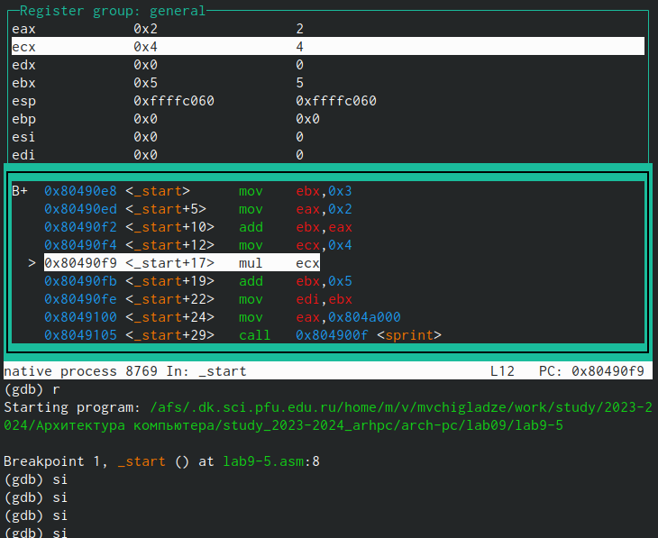{#fig:017 width=70%}

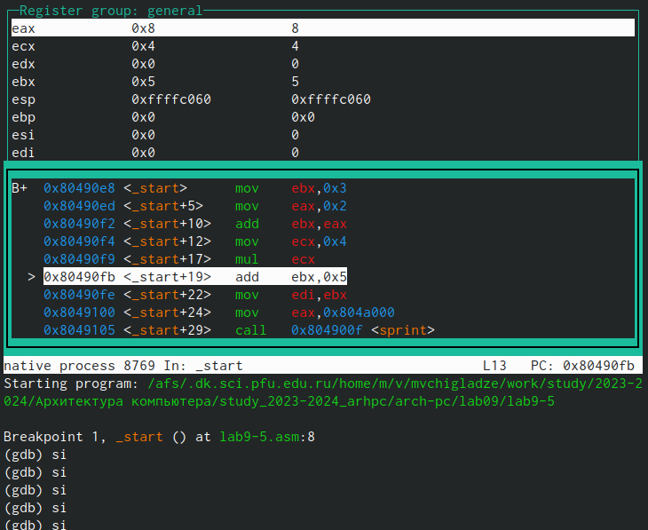{#fig:018 width=70%}

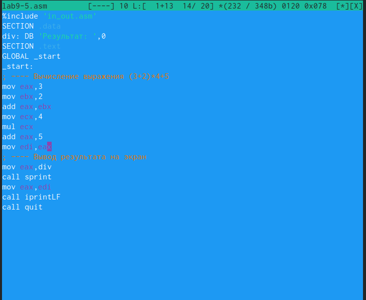{#fig:019 width=70%}

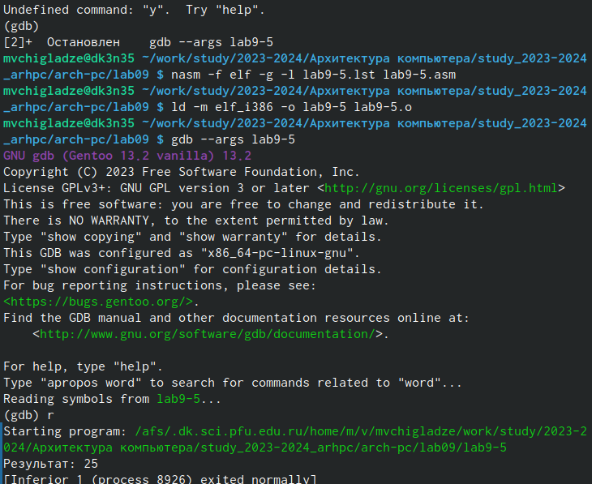{#fig:020 width=70%}

# **Выводы**

В ходе лабораторной работы, я приобрела навыки написания программ с использованием подпрограмм. Познакомилась с методами отладки при помощи GDB и его основными возможностями.

# Список литературы{.unnumbered}

::: {#refs}
:::
