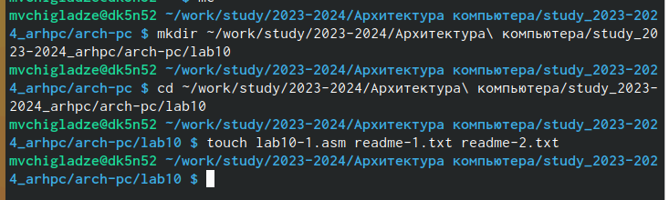
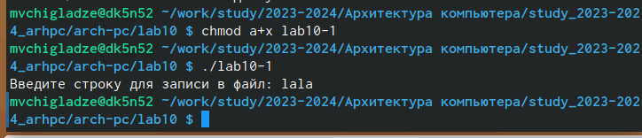
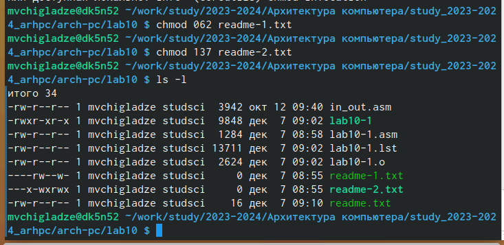
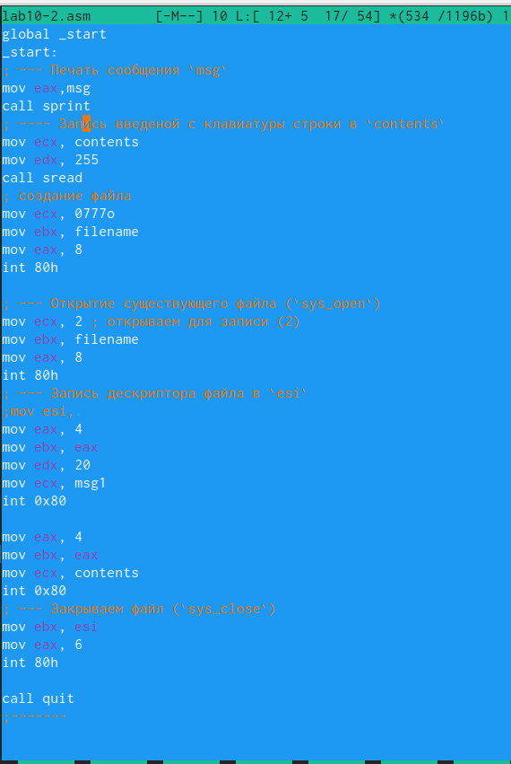
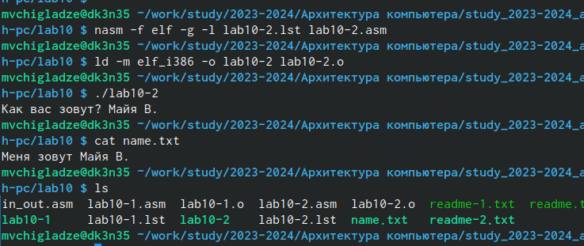

---
## Front matter
title: "Отчет по лабораторной работе №10"
subtitle: "Простейший вариант"
author: "Чигладзе Майя Владиславовна"

## Generic otions
lang: ru-RU
toc-title: "Содержание"

## Bibliography
bibliography: bib/cite.bib
csl: pandoc/csl/gost-r-7-0-5-2008-numeric.csl

## Pdf output format
toc: true # Table of contents
toc-depth: 2
lof: true # List of figures
lot: true # List of tables
fontsize: 12pt
linestretch: 1.5
papersize: a4
documentclass: scrreprt
## I18n polyglossia
polyglossia-lang:
  name: russian
  options:
	- spelling=modern
	- babelshorthands=true
polyglossia-otherlangs:
  name: english
## I18n babel
babel-lang: russian
babel-otherlangs: english
## Fonts
mainfont: PT Serif
romanfont: PT Serif
sansfont: PT Sans
monofont: PT Mono
mainfontoptions: Ligatures=TeX
romanfontoptions: Ligatures=TeX
sansfontoptions: Ligatures=TeX,Scale=MatchLowercase
monofontoptions: Scale=MatchLowercase,Scale=0.9
## Biblatex
biblatex: true
biblio-style: "gost-numeric"
biblatexoptions:
  - parentracker=true
  - backend=biber
  - hyperref=auto
  - language=auto
  - autolang=other*
  - citestyle=gost-numeric
## Pandoc-crossref LaTeX customization
figureTitle: "Рис."
tableTitle: "Таблица"
listingTitle: "Листинг"
lofTitle: "Список иллюстраций"
lotTitle: "Список таблиц"
lolTitle: "Листинги"
## Misc options
indent: true
header-includes:
  - \usepackage{indentfirst}
  - \usepackage{float} # keep figures where there are in the text
  - \floatplacement{figure}{H} # keep figures where there are in the text
---

# **Цель работы**

Приобретение навыков написания программ для работы с файлами

# **Порядок выполнения лабораторной работы**

### Задание 1

Создала каталог для программам лабораторной работы № 10, перешла в него и создала файл lab10-1.asm, readme-1.txt, readme-2.txt (рис. [@fig:001])

{#fig:001 width=70%}

### Задание 2

Введу в файл lab10-1.asm текст программы из листинга 10.1 (Программа записи в файл сообщения). Создам исполняемый файл и проверю его работу (рис. [@fig:002]), для правильного выполнения программы я создала файла readme.txt.

{#fig:002 width=70%}

### Задание 3

С помощью команды chmod изменю права доступа к исполняемому файлу lab10-1, запретив его выполнение. Попытаюсь выполнить файл (рис. [@fig:003]). Объясню результат. Команда chmod меняет права доступа, a - у всех пользователей, включая владельца,- забирает права, x - забирает права на исполнение, а дальше у какого-то файла. И так как я владелец, мне тоже отказано в доступе.

{#fig:003 width=70%}

### Задание 4

С помощью команды chmod изменю права доступа к файлу lab10-1.asm с исходным текстом программы, добавив права на исполнение (рис. [@fig:004]). Попытаюсь выполнить его и объясню результат. Изменила - на +, чтобы добавить права всем обратно, файл исполняется.

{#fig:004 width=70%}

### Задание 5

В соответствии с вариантом в таблице 10.4 предоставлю права доступа к файлу readme-1.txt представленные в символьном виде, а для файла readme-2.txt – в двочном виде. Проверю правильность выполнения с помощью команды ls -l (рис. [@fig:005]).

{#fig:005 width=70%}

# **Задание для самостоятельной работы**

## Задание 1

Напишу программу работающую по следующему алгоритму (рис. [@fig:006]):
• Вывод приглашения “Как Вас зовут?”
• ввести с клавиатуры свои фамилию и имя
• создать файл с именем name.txt
• записать в файл сообщение “Меня зовут”
• дописать в файл строку введенную с клавиатуры
• закрыть файл
Создам исполняемый файл и проверю его работу. Проверю наличие файла и его
содержимое с помощью команд ls и cat (рис. [@fig:007]).

{#fig:006 width=70%}

{#fig:007 width=70%}

# **Выводы**

В ходе лабораторной работы, я приобрела навыки написания программ для работы с файлами

# Список литературы{.unnumbered}

::: {#refs}
:::
